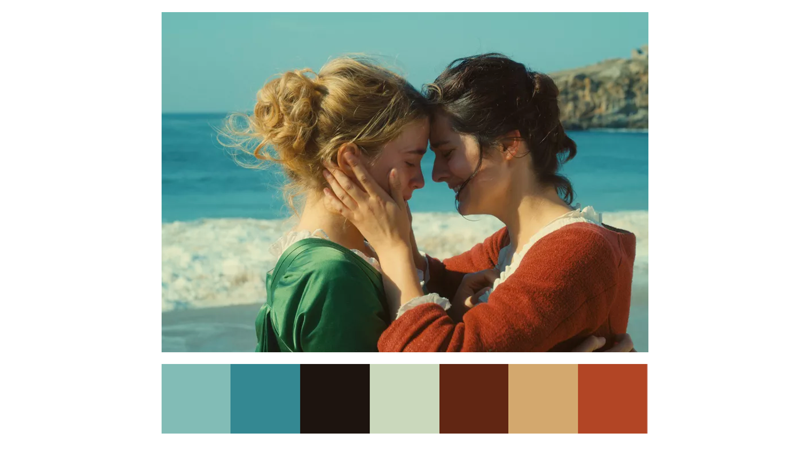

```{r setup, include=FALSE}
knitr::opts_chunk$set(echo = TRUE)
```

# Portrait of a ggplot on fire `r emo::ji("fire")`



<font size="1"> Picture taken from Pyramide Films.</font>

```{r, include=FALSE, echo=FALSE, message=FALSE}
library(emo) # add emojis in RMarkdown documents
```

## Extracting colors from images with the colorfindr package
This is a short tutorial that will get you started with building your very own custom color palette with the {colorfindr} package by David Zumbach and Mara Averick, and implement it in a ggplot. For this we will be using the wonderful Palmer Penguins package by Allison Horst, Alison Hill, Hadley Wickham, Trang Le and Jannik Buhr. There are many, many color palettes already out there, but what I love about colorfindr is that it is 100% customizable. You can choose to extract however many colors you want and use any favorite film, TV show or art work as inspiration.  

### Step 1: Install colorfindr  
```{r, message=FALSE}
# install.packages("colorfindr") 
# install.packages("tidyverse") 
# install.packages("palmerpenguins")
library(colorfindr) # extracts colors from images
library(tidyverse) # tidy data wrangling & plotting
```

### Step 2: Extract colors from images
```{r}
# Get colors and create a palette with n = 5 
get_colors("images/hemadramamaisexterieure4612433621.jpg") %>% # you can reference a local file on your computer or a jpg web address
  make_palette(n = 5) # here we extract 5 colors
```

You can play around with how many colors you extract - this will depend on what your data looks like. Do you want to show a few different categories or continuous values? **Tip**: For very expressive color palettes, I would pick images with strong, vibrant colors. For example:  


If you've decided that you want 3 different colors, save your new palette to a so-called character vector. You can also 'set a seed', which will ensure that you get the same colors every time you run your script.  
```{r}
# Use your favorite magic number to set a seed:
# set.seed(42)
PLF<- get_colors("images/hemadramamaisexterieure4612433621.jpg") %>% 
  make_palette(n = 3)
```

### Step 3: Use your new palette

From this:
```{r, warning=FALSE}
library(palmerpenguins) # get the penguin data
penguins %>% # feed ggplot the data
  ggplot(aes(flipper_length_mm, fill = species)) + # we want to investigate the flipper length of our penguin friends
  geom_density(alpha = 0.8, color =NA)+ # specify how you want to display the data
  theme_minimal() # pick a theme
```

To this `r emo::ji("fire")`:
```{r, warning=FALSE}
penguins %>%
  ggplot(aes(flipper_length_mm, fill = species)) +
  geom_density(alpha = 0.8, color =NA)+
  scale_fill_manual(values = PLF)+
  theme_minimal()
```

For more information on the colorfindr package, go to: https://github.com/zumbov2/colorfindr  
For more information on Palmer Penguins, go to: https://github.com/allisonhorst/palmerpenguins  