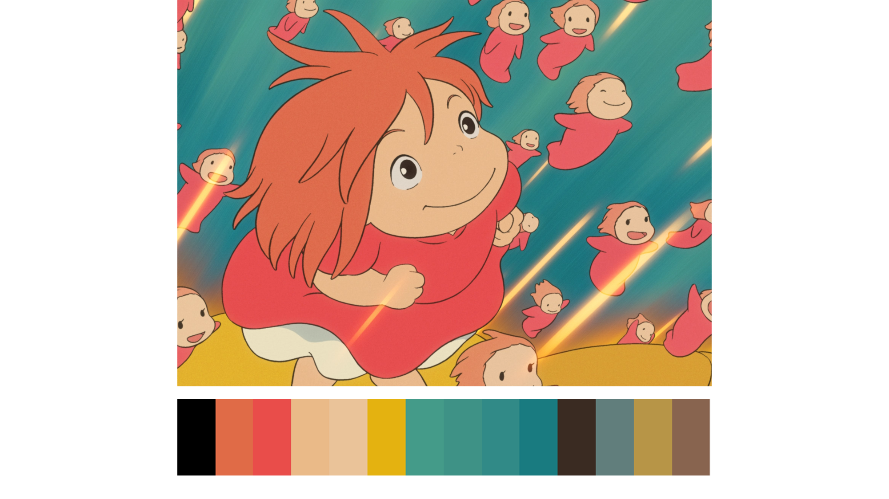

# Portrait of a ggplot on fire 🔥


<font size="1"> Picture taken from Pyramide Films.</font>

## Extracting colors from images with the colorfindr package

This is a short tutorial that will get you started with building your
very own custom color palette with the {colorfindr} package by David
Zumbach, and implement it in a ggplot. For this we will
be using the wonderful Palmer Penguins package by Allison Horst, Alison Hill and Kristen Gorman. 
There are many, many color palettes already out there, but what I love about colorfindr is
that it is 100% customizable. You can choose to extract however many
colors you want and use any favorite film, TV show or art work as
inspiration.

### Step 1: Install colorfindr

``` r
# install.packages("colorfindr") 
# install.packages("tidyverse") 
# install.packages("palmerpenguins")
library(colorfindr) # extracts colors from images
library(tidyverse) # tidy data wrangling & plotting
```

### Step 2: Extract colors from images

``` r
# Get colors and create a palette with n = 5 
get_colors("images/hemadramamaisexterieure4612433621.jpg") %>% # you can reference a local file on your computer or a jpg web address
  make_palette(n = 5) # here we extract 5 colors
```

<!-- -->

    ## [1] "#7EBDB5" "#338791" "#CCD9BD" "#1D1512" "#714F34"

You can play around with how many colors you extract - this will depend
on what your data looks like. Do you want to show a few different
categories or continuous values? **Tip**: For very expressive color
palettes, I would pick images with strong, vibrant colors. For example:



If you’ve decided that you want 3 different colors, save your new
palette to a so-called character vector. You can also ‘set a seed’,
which will ensure that you get the same colors every time you run your
script.

``` r
# Use your favorite magic number to set a seed:
# set.seed(42)
PLF<- get_colors("images/hemadramamaisexterieure4612433621.jpg") %>% 
  make_palette(n = 3)
```

<!-- -->

### Step 3: Use your new palette

From this:

``` r
library(palmerpenguins) # get the penguin data
penguins %>% # feed ggplot the data
  ggplot(aes(flipper_length_mm, fill = species)) + # we want to investigate the flipper length of our penguin friends
  geom_density(alpha = 0.8, color =NA)+ # specify how you want to display the data
  theme_minimal() # pick a theme
```

<!-- -->

To this 🔥:

``` r
penguins %>%
  ggplot(aes(flipper_length_mm, fill = species)) +
  geom_density(alpha = 0.8, color =NA)+
  scale_fill_manual(values = PLF)+
  theme_minimal()
```

<!-- -->

### Get inspired by the cool palettes other folks made with colorfindr

[Kelly Cotton](https://twitter.com/kllycttn) built a new package of New York-inspired palettes: https://github.com/kellycotton/nycpalettes


[Ben Stanley](https://twitter.com/BDStanley) made a palette for Kieslowski's "Dekalog":https://twitter.com/BDStanley/status/1307605257019629570 


[Lydia Hopper](https://twitter.com/LydiaMHopper) made a palette inspired by Japanese macaques: https://twitter.com/LydiaMHopper/status/1308403623592943616


[Kaylea](https://twitter.com/KayleaHaynes) was inspired by #TidyTuesday and looked at reasons for expedition terminations: https://twitter.com/KayleaHaynes/status/1308799804357709825
  

[John MacKintosh](https://twitter.com/_johnmackintosh) made his own "Metallicart" package with album covers of Metallica as inspiration: https://github.com/johnmackintosh/metallicaRt
  

[Kelly Morrow McCarthy](https://twitter.com/KellyMM_neuro) was inspired by an abstract photo: https://twitter.com/KellyMM_neuro/status/1308763829095063560
  


### References.  
* Horst AM, Hill AP, Gorman KB (2020). palmerpenguins: Palmer Archipelago (Antarctica) penguin data. R package version 0.1.0. https://allisonhorst.github.io/palmerpenguins/. doi: 10.5281/zenodo.3960218.  
* Zumbach, D. colorfindr. R package version 0.1.3. https://github.com/zumbov2/colorfindr.  
